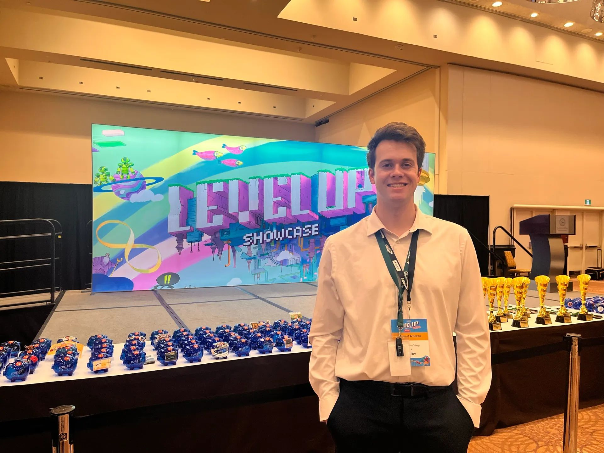

  <h1 style="font-size: 3em; margin-bottom: 0px; color: #ffffff !important; opacity: 1 !important;">Tristan Anglin</h1>
  

    <strong style="color: #ffffff !important; opacity: 1 !important;">Game Developer | Systems Architect & UI Designer</strong>
  

  &nbsp;
  &nbsp;
  
   
  &nbsp;
  &nbsp;
  

  <button class="tab-btn active-tab" onclick="switchTab(event, 'about-tab')">
    Overview & Skills
    Core Profile
  </button>
  <button class="tab-btn" onclick="switchTab(event, 'blood-lineage')">
    Blood & Lineage
    2026 • UE5
  </button>
  <button class="tab-btn" onclick="switchTab(event, 'tower-defense')">
    Tower Defense
    2024 • C++
  </button>
  <button class="tab-btn" onclick="switchTab(event, 'darkside')">
    Your Dark Side
    2023 • Java
  </button>
  <button class="tab-btn" onclick="switchTab(event, 'dungeon')">
    Dungeon Crawler
    2017 • Python
  </button>
  <button class="tab-btn" onclick="switchTab(event, 'hit-run')">
    Hit & Run
    2016 • Python
  </button>

  

  <table border="0" style="width: 100%; border-collapse: collapse; border: none;">
    <tr style="border: none;">
      <td width="55%" valign="top" style="border: none; background: transparent; padding-right: 15px;">
        

          Growing up in a household with a 300+ board game collection gave me an intuitive grasp of game balance and systems design long before I wrote my first line of code.
        

        

          My programming journey began in 2016 with Python, but my curiosity quickly outpaced the classroom. This drive led me to self-teach Java to develop "Your Dark Side." I soon realized my true calling was in the technical architecture and creative heart of game design.
        

        

          A 2026 Honors Graduate in Game Development, I have maintained a 3.86 GPA while dedicating myself to building a portfolio of modular core systems and dynamic user interfaces.
        

      </td>

      <td width="45%" valign="top" align="center" style="border: none; background: transparent; line-height: 1.8;">
        

          <b style="color: #ffffff;">Programming & Engines</b> 
          
          
          
          
          
          
        

        

          <b style="color: #ffffff;">Workflow & Version Control</b> 
          
          
          
          
          
        

        

          <b style="color: #ffffff;">Development Environments</b> 
          
          
          
        

        

          <b style="color: #ffffff;">Art, Audio & UI Design</b> 
          
          
          
          
          
          
        

      </td>
    </tr>
  </table>

  

  

    
  

  

    
    
  

  
  

    <b style="color: #f0f6fc; font-size: 1.1em;">3D Co-op Musou RPG (Capstone Project)</b>
    <b style="color: #da765b; font-size: 1.1em;">Lead Systems Architect & UI Programmer</b>
  

  

    

      Led the technical roadmap and framework development for an 11-person team. Personally architected the core gameplay loops, server-authoritative multiplayer infrastructure, and a comprehensive suite of UI/UX systems. Managed cross-department stability and build delivery utilizing <b>Jira</b> and <b>GitHub</b>.
    

    

      
20+

      
Networked Systems

      
50+

      
Vector UI Assets

    

  

  

    

      <iframe src="https://www.youtube.com/embed/tgr0kjX5Q0Q?autoplay=1&mute=1&loop=1&playlist=tgr0kjX5Q0Q&controls=1&modestbranding=1" title="Blood & Lineage Gameplay" style="position: absolute; top: 0; left: 0; width: 100%; height: 100%; border: none;" allow="autoplay; encrypted-media; picture-in-picture" allowfullscreen></iframe>
    

  

  

    "My workflow prioritizes networking and system state first. I engineer structural foundations and client/server validation profiles before implementing vector aesthetics, custom animations, and responsive motion graphics."
  

  <h3 style="margin-bottom: 5px; color: #ffffff; font-size: 1.3em;">Core Contributions Breakdown</h3>
  

  

    

      <b style="color: #ffffff; font-size: 1.1em;">Multiplayer Architecture & Systems Framework</b>
      C++ / Blueprints / Replication
    

    
    <ul style="margin: 0 0 20px 0; padding-left: 20px; line-height: 1.6; color: #c9d1d9;">
      <li><b>Architected Core Separation:</b> Refactored codebase into a clean model splitting logic across <i>Character</i> (combat/movement), <i>Player Controller</i> (UI/Inputs), and <i>Player State</i> (persistent multiplayer variables).</li>
      <li><b>Engineered Seamless Travel Persistence:</b> Designed a deep state copying system carrying player data (stats, inventory, meta-progression) across multiplayer level transitions safely.</li>
      <li><b>Implemented Multi-user Handshakes:</b> Developed server-authoritative logic for synchronized loot drops, currency accumulation, and player interactions for up to 4 concurrent clients.</li>
      <li><b>Prevented Design Soft-locks:</b> Built an automated, scaling Class-Locked Signature Weapon system ensuring players remain continuously viable without the risk of destroying primary weapon items.</li>
    </ul>

    

      

        

          <b style="color: #ffffff; font-size: 0.95em; display: block; margin-bottom: 4px;">PlayerState Data Serialization</b>
          

            During seamless travel transitions, the engine destroys and regenerates Actor states. To prevent loss of progress, `CopyProperties` intercepts the tear-down to manually pass player statistics, currencies, and deeply copied inventory outer arrays over to the newly instantiated world state.
          

        

        

          
          🔍 Click to expand CopyProperties.cpp
        

      

      

        

          <b style="color: #ffffff; font-size: 0.95em; display: block; margin-bottom: 4px;">Level Transition UI Garbage Culling</b>
          

            World destruction without proactive UI tracking results in fatal engine null-pointer references. This architectural cleanup routine systematically unbinds input frames, culls active viewports, and marks non-viewport/3D widgets directly for clean garbage collection before map streams clear.
          

        

        

          
          🔍 Click to expand CleanUI.cpp
        

      

    

  

  

    

      <b style="color: #ffffff; font-size: 1.1em;">Full-Stack UI/UX Engineering & Unified Drag-and-Drop</b>
      UMG / Slate / Motion Design
    

    
    <ul style="margin: 0 0 20px 0; padding-left: 20px; line-height: 1.6; color: #c9d1d9;">
      <li><b>Interface Suite Development:</b> Programmed over 20+ intricate screens including a networked 4-Player Match Lobby, interactive Keybind Remappers, Save Management Profiles, and specialized Armory systems.</li>
      <li><b>Engineered Custom Visual Payloads:</b> Programmed a unified `UDragDropOperation` subclass passing full `FItemData` memory frames to let user drag actions seamlessly bridge across the distinct Inventory, Forge, and Armory UI panels natively.</li>
      <li><b>Dynamic HUD & State Feedback:</b> Built a responsive player HUD factoring formula-based calculations (e.g., Intelligence stats dynamically adjusting displayed mana costs in real-time) and low-health UI vignettes.</li>
      <li><b>Graphic Asset Production:</b> Hand-crafted and vectorized a cohesive library of 50+ custom flat-design icons spanning difficulty tiers, classes, stats, and equipment matrices.</li>
    </ul>

    <b style="color: #ffffff; font-size: 0.95em; display: block; margin-bottom: 10px; padding-left: 5px;">Visual Breakdown: System Prototyping to Production Assets</b>
    

      

        
        
<b>Phase 1:</b> Screen Wireframe & Core Functional Grid

      

      

        
        
<b>Phase 2:</b> Vector Asset Pipeline Integration

      

      

        
        
<b>Phase 3:</b> Responsive HUD State & Drag Contexts

      

    

  

  

    

      <b style="color: #ffffff; font-size: 1.1em;">Advanced Economy Mechanics (Forge & Armory)</b>
      Data Structures / Math Logic
    

    
    

      

        <ul style="margin: 0; padding-left: 20px; line-height: 1.6; color: #c9d1d9;">
          <li><b>Modular Optimization:</b> Programmed a highly decoupled <i>Inventory Actor Component</i> separating item processing into a light, flat replication struct data block (`FItemData`) inside a single `UObject` interface shell to protect network limits.</li>
          <li><b>Cross-Item Forging Logic:</b> Created an algebraic upgrading suite handling dual-input asset compression that handles custom rarity distributions using secure, server-side weighted tables.</li>
          <li><b>Secure Transaction Loop:</b> Enforced strict server validation across all Armory global vendor shops, protecting inventory state changes and bulk item clearances.</li>
          <li><b>QoL Algorithms:</b> Wrote item parsing automation enabling one-click optimal "Auto-Equip" sweeps alongside an unexamined inventory tracker engine.</li>
        </ul>
      

      
      

        

          

            <b style="color: #ffffff; font-size: 0.95em; display: block; margin-bottom: 4px;">Optimized Memory Layout</b>
            

              By separating the lightweight primitive data array matrix (`FItemData`) from the higher-level network-supported wrapper (`UItemObject`), the architecture minimizes RPC signature size during bulk trades.
            

          

          

            
            🔍 Click to expand ItemObject.h
          

        

        

          

            <b style="color: #ffffff; font-size: 0.95em; display: block; margin-bottom: 4px;">Server-Side Probability Math</b>
            

              The item combination system compresses dual items down to singular upward-tier elements. All logic resolves deterministically via random probability weighting algorithms locked behind authority barriers.
            

          

          

            
            🔍 Click to expand Forge Logic
          

        

      

    

  

  

    

      <b style="color: #ffffff; font-size: 1.1em;">Boss AI & Networked Encounter Design (Hades)</b>
      AI Behavior / Gameplay Scripting
    

    
    

      

        <ul style="margin: 0; padding-left: 20px; line-height: 1.6; color: #c9d1d9;">
          <li><b>Multi-Phase State Machinery:</b> Programmed the complex, multi-tiered Hades encounter sequencing behaviors, custom animation blends, and phase transition logic.</li>
          <li><b>Network Prediction Meshes:</b> Engineered an original approach generating synchronized visual telegraph projections locally across clients instantly, keeping gameplay tight under latency.</li>
          <li><b>Adaptive Combat Scaling:</b> Constructed real-time algorithmic triggers adapting sweep speeds, rotation frequencies, and projectile volume attributes tied directly to lobby-wide chosen difficulty settings.</li>
          <li><b>Cinematic Integrations:</b> Synchronized camera blends linking cinematic entryways directly into actionable combat frames to organically telegraph impending mechanical threats.</li>
        </ul>
      

      

        

          
          View Boss State Machine Graph
        

        

          
          View Client Predictive Projection Mesh
        

      

    

  

  <h3 style="margin-top: 30px; margin-bottom: 5px; color: #ffffff; font-size: 1.3em;">Engineering Post-Mortem</h3>
  

  

    

      <b style="color: #ffffff;">The Challenge: Network Synchronization</b>
      

        Architecting a 4-player co-op Musou game introduced severe replication challenges. Systems that performed flawlessly in standalone environments suffered from client-side race conditions and severe tracking variance during high-density enemy swarms.
      

    

    

      <b style="color: #ffffff;">The Resolution: Server-Authoritative Logic</b>
      

        Enforced strict server-authoritative logic. Implemented secure RPC handshakes for vital systems (loot states, spell tracking) and decoupled local client-side UI visual execution completely from back-end replicated states to secure stability.
      

    

  

  

    
    
  

  

    <b style="color: #f0f6fc; font-size: 1.1em;">Custom C++ 2D Engine Grid Strategy Game</b>
    <b style="color: #da765b; font-size: 1.1em;">Solo Core Systems Engineer</b>
  

  

    

      Developed a modular grid deployment strategy game inside a custom engine wrapper constructed from scratch. Hand-rolled structural system runloops, pixel tracking boundaries, cell spatial partitions, and tactical calculations independently of storefront middleware dependencies.
    

    

      
Low Level

      
Engine Architecture

      
60 FPS

      
Fixed Render Loop

    

  

  

    

      <iframe src="https://www.youtube.com/embed/zI8zVscW2sc?autoplay=0&mute=1&loop=1&controls=1" title="Tower Defense Gameplay" style="position: absolute; top: 0; left: 0; width: 100%; height: 100%; border: none;" allow="autoplay; encrypted-media; picture-in-picture" allowfullscreen></iframe>
    

  

  <h3 style="margin-bottom: 5px; color: #ffffff; font-size: 1.3em;">Core Contributions Breakdown</h3>
  

  

    

      <b style="color: #ffffff; font-size: 1.1em;">Systems Architecture & Spatial Grids</b>
      C++ / Architecture / Optimization
    

    <ul style="margin: 0; padding-left: 20px; line-height: 1.6; color: #c9d1d9;">
      <li><b>Engine Architecture foundations:</b> Established structured runtime ticks keeping game logic mutations strictly processing isolated away from visual swapbuffers routines.</li>
      <li><b>Spatial Partition Layouts:</b> Programmed optimized array matrices mapping grid nodes to execute rapid, high-speed coordinate intersection updates cleanly.</li>
    </ul>
  

  <h3 style="margin-top: 30px; margin-bottom: 5px; color: #ffffff; font-size: 1.3em;">Engineering Post-Mortem</h3>
  

  

    

      <b style="color: #ffffff;">The Challenge: Memory Management</b>
      

        Instantiating high volumes of actors and active projectiles dynamically frame-by-frame introduced memory fragmentation bottlenecks and micro-stuttering issues inside a custom heap architecture.
      

    

    

      <b style="color: #ffffff;">The Resolution: Memory Pre-Allocation Pools</b>
      

        Swapped dynamic runtime instantiation out for structured contiguous pre-allocation blocks, systematically re-indexing deactivated element vectors to completely secure a smooth, locked 16.6ms loop.
      

    

  

  

    
    
  

  

    <b style="color: #f0f6fc; font-size: 1.1em;">2D Top-Down Psychological Action Game</b>
    <b style="color: #da765b; font-size: 1.1em;">Self-Taught Systems Programmer</b>
  

  

    

      Constructed as an ambitious self-taught initiative to break past academic limits. Developed custom multi-threaded game state loops, dynamic environment array tilemaps, sprite sheet asset parsers, and a localized input controller matrix via native <b>Java AWT/Swing</b> libraries.
    

    

      
100%

      
Independent Development

      
Multi-Threaded

      
State Separation

    

  

  

    

      <iframe src="https://www.youtube.com/embed/Yp9wPeygKls?autoplay=0&mute=1&loop=1&controls=1" title="Your Dark Side Gameplay" style="position: absolute; top: 0; left: 0; width: 100%; height: 100%; border: none;" allow="autoplay; encrypted-media; picture-in-picture" allowfullscreen></iframe>
    

  

  <h3 style="margin-bottom: 5px; color: #ffffff; font-size: 1.3em;">Core Contributions Breakdown</h3>
  

  

    

      <b style="color: #ffffff; font-size: 1.1em;">Thread Operations & Asset Matrices</b>
      Java / Threads / Bitmaps
    

    <ul style="margin: 0; padding-left: 20px; line-height: 1.6; color: #c9d1d9;">
      <li><b>Concurrent Loop Decoupling:</b> Engineered distinct state loops assigning background system threads to process mechanical variables away from the main UI refresh window.</li>
      <li><b>Sprite Sheet Splitting:</b> Wrote runtime file streams translating single asset textures directly into uniform state-bound movement arrays seamlessly.</li>
    </ul>
  

  <h3 style="margin-top: 30px; margin-bottom: 5px; color: #ffffff; font-size: 1.3em;">Engineering Post-Mortem</h3>
  

  

    

      <b style="color: #ffffff;">The Challenge: Data Race Concurrency</b>
      

        Running separate tracking loops manipulating uniform variable matrices simultaneously caused thread collisions and application runtime deadlock faults.
      

    

    

      <b style="color: #ffffff;">The Resolution: Synchronization & State Splitting</b>
      

        Structured strict synchronicity gateways across critical vector functions, completely caching calculation changes into intermediate data slots before submitting to render pools.
      

    

  

  

    
    
  

  

    <b style="color: #f0f6fc; font-size: 1.1em;">ASCII Procedural Roguelike Systems Engine</b>
    <b style="color: #da765b; font-size: 1.1em;">Systems Designer & Logic Programmer</b>
  

  

    

      An early foundation exploring modular system parsing. Built a grid-based turn strategy framework tracking coordinate arrays inside multidimensional list maps. Implemented inventory structures, encounter calculations, and automated text output parsing layers.
    

    

      
2D Matrix

      
World Grid Mapping

      
Turn-Based

      
Step Track Engine

    

  

  

    

      <iframe src="https://www.youtube.com/embed/SOfbcoDshmE?autoplay=0&mute=1&loop=1&controls=1" title="Dungeon Crawler Showcase" style="position: absolute; top: 0; left: 0; width: 100%; height: 100%; border: none;" allow="autoplay; encrypted-media; picture-in-picture" allowfullscreen></iframe>
    

  

  <h3 style="margin-bottom: 5px; color: #ffffff; font-size: 1.3em;">Core Contributions Breakdown</h3>
  

  

    

      <b style="color: #ffffff; font-size: 1.1em;">Procedural Text Processing Logic</b>
      Python / Text / Scripting
    

    <ul style="margin: 0; padding-left: 20px; line-height: 1.6; color: #c9d1d9;">
      <li><b>Coordinate Step Maps:</b> Programmed clean tracking grids mapping characters and environmental structures into distinct numerical coordinates for conflict checks.</li>
      <li><b>Dynamic Stat Generation:</b> Developed item tables calculating random attribute modifiers and equipment requirements based on character progression scales.</li>
    </ul>
  

  

    
    
  

  

    <b style="color: #f0f6fc; font-size: 1.1em;">2D Core Arcade Reflex Game</b>
    <b style="color: #da765b; font-size: 1.1em;">Foundational Software Engineer</b>
  

  

    

      My initial foray into codebase design. Engineered using basic graphic wrappers to master loop handling principles. Programmed real-time tracking checks, automated variable score multipliers, and localized boundary resolution vectors.
    

    

      
2D Screen

      
Vector Bounds

      
Real-Time

      
Coordinate Loops

    

  

  

    

      <iframe src="https://www.youtube.com/embed/Z0p9vT0xN2M?autoplay=0&mute=1&loop=1&controls=1" title="Hit and Run Gameplay" style="position: absolute; top: 0; left: 0; width: 100%; height: 100%; border: none;" allow="autoplay; encrypted-media; picture-in-picture" allowfullscreen></iframe>
    

  

  <h3 style="margin-bottom: 5px; color: #ffffff; font-size: 1.3em;">Core Contributions Breakdown</h3>
  

  

    

      <b style="color: #ffffff; font-size: 1.1em;">Foundational Architecture Elements</b>
      Python / Core / Logic
    

    <ul style="margin: 0; padding-left: 20px; line-height: 1.6; color: #c9d1d9;">
      <li><b>Coordinate Boundaries:</b> Configured boundary checking formulas intercepting player inputs to clamp spatial translation within acceptable window domains.</li>
      <li><b>Incremental Scaling Loops:</b> Managed dynamic difficulty adjustment arrays accelerating object velocities based on elapsed runtime metrics.</li>
    </ul>
  

