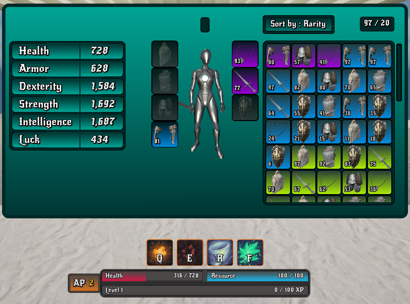
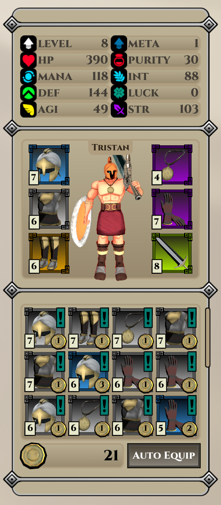
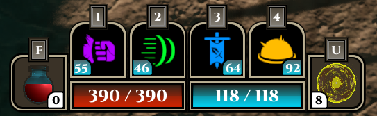
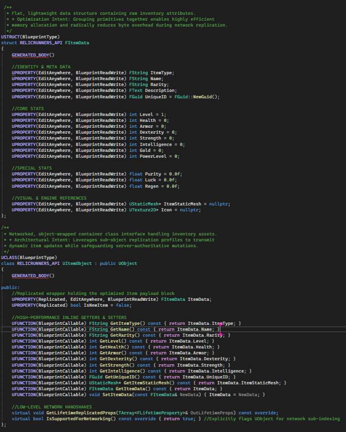
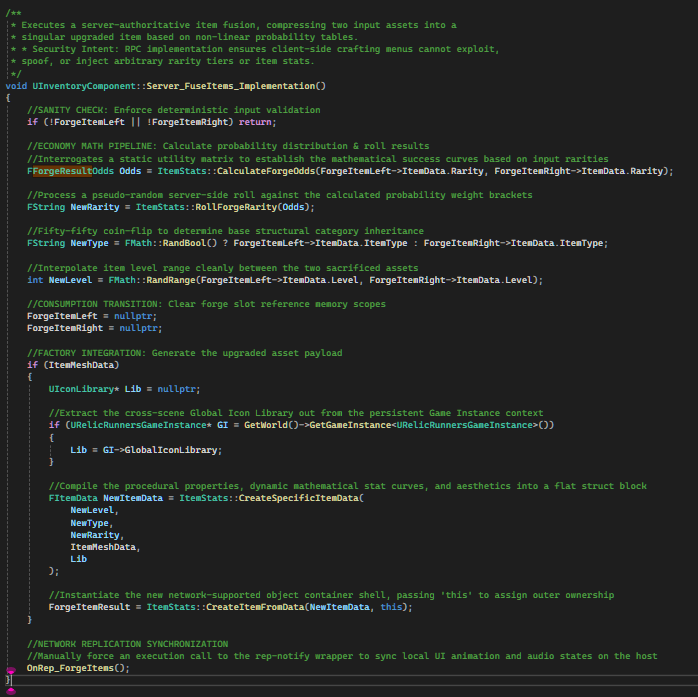

<!-- Include Font Awesome Icons Library at the Top -->
<link rel="stylesheet" href="https://cdnjs.cloudflare.com/ajax/libs/font-awesome/6.5.1/css/all.min.css">

<!-- Clean Header Container (Glow Removed) -->

  <h1 style="font-size: 3.2em; margin-bottom: 0px; color: #ffffff !important; opacity: 1 !important; text-shadow: 0px 2px 8px rgba(0,0,0,0.8); font-weight: 800;">Tristan Anglin</h1>
  

    <strong style="color: #ffffff !important;">Gameplay Programmer | Systems & UI Architect</strong>
  

  

    Actively seeking opportunities
  

<!-- Global External Link Grid Container -->

  <a class="custom-link-btn" href="https://tristananglin.github.io/RESUME - GAME DEVELOPMENT.pdf" target="_blank">
    Resume
    PDF
  </a>
  <a class="custom-link-btn" href="https://linkedin.com/in/TristanAnglin" target="_blank">
    LinkedIn
    Professional Network
  </a>
  <a class="custom-link-btn" href="mailto:tmanglin00@gmail.com">
    Email
    Reach out
  </a>
  <a class="custom-link-btn" href="https://github.com/TristanAnglin" target="_blank">
    GitHub
    Source Code
  </a>
  <a class="custom-link-btn" href="https://www.instagram.com/tristananglin_" target="_blank">
    Instagram
    Dev Logs
  </a>
  <a class="custom-link-btn" href="https://www.youtube.com/@TristanAnglin" target="_blank">
    YouTube
    Gameplay Showcases
  </a>

<!-- Clean Visual Divisor Break -->

<!-- Unified Grid Layout Wrapper with Full-Width Overview -->

  <!-- Full-Width Overview Tab (Spans all 3 columns) -->
  <button class="tab-btn active-tab" onclick="switchTab(event, 'about-tab')" style="grid-column: 1 / -1 !important;">
    
      Overview & Skills
    
    Core Profile
  </button>
  
  <!-- Project Tabs (Perfectly distributed 3x2 grid underneath) -->
  <button class="tab-btn" onclick="switchTab(event, 'round-based-survival')">
    
      Round Based Survival 
      <i class="fa-brands fa-steam" style="color: #66c0f4; font-size: 0.95em; margin-left: 6px; margin-right: 6px; margin-top: -1px;" title="Planned Steam Release"></i>
      
    
    In Development
  </button>

  <button class="tab-btn" onclick="switchTab(event, 'blood-lineage')">
    
      Blood & Lineage 
      <i class="fa-brands fa-steam" style="color: #66c0f4; font-size: 0.95em; margin-left: 6px; margin-right: 6px; margin-top: -1px;" title="Coming to Steam"></i>
      
    
    Sept 2025 - April 2026
  </button>
  
  <button class="tab-btn" onclick="switchTab(event, 'tower-defense')">
    
      Tower Defense 
      
    
    Dec 2024
  </button>
  
  <button class="tab-btn" onclick="switchTab(event, 'darkside')">
    
      Your Dark Side 
      
    
    2023
  </button>
  
  <button class="tab-btn" onclick="switchTab(event, 'dungeon')">
    
      Dungeon Crawler 
      
    
    2017
  </button>
  
  <button class="tab-btn" onclick="switchTab(event, 'hit-run')">
    
      Hit & Run 
      
    
    2016
  </button>

  <table border="0" style="width: 100%; border-collapse: collapse; border: none;">
    <tr style="border: none;">
      <td width="55%" valign="top" style="border: none; background: transparent; padding-right: 15px;">
        

          Growing up in a household with a 300+ board game collection gave me an intuitive grasp of game balance and systems design long before I wrote my first line of code.
        

        

          My programming journey began in 2016 with Python, but my curiosity quickly outpaced the classroom. This drive led me to self-teach Java to develop "Your Dark Side." I soon realized my true calling was in the technical architecture and creative heart of game design.
        

        

          A 2026 Honors Graduate in Game Development, I have maintained a 3.86 GPA while dedicating myself to building a portfolio of modular core systems and dynamic user interfaces.
        

      </td>

      <td class="skill-group" width="45%" valign="top" align="center" style="border: none; background: transparent; line-height: 1.8;">
        

          <b style="color: #ffffff;">Programming</b> 
          
          
          
          
          
          
        

        

          <b style="color: #ffffff;">Workflow & Version Control</b> 
          
          
          
          
          
        

        

          <b style="color: #ffffff;">Development Environments & Engines</b> 
          
          
          
          
          
        

        

          <b style="color: #ffffff;">Art, Audio & UI Design</b> 
          
          
          
          
          
          
        

      </td>
    </tr>
  </table>

  

  <!-- Presentation Frame for Showcase Photo -->
  

    
  

  
  

    <!-- Left Side: Title Badge + Unity Logo -->
    

      
      
    

    
    <!-- Middle: Steam Release Badge -->
    

      
        <i class="fa-brands fa-steam" style="color: #66c0f4; font-size: 1.5em; margin-left: 6px; margin-right: 6px; margin-top: -1px;" title="Planned Steam Release"></i>
        Planned Steam Release
      
    

    
    <!-- Right Side: Status Badge -->
    
  

  <!-- Sub-Header Metadata Line -->
  

    <b style="color: #f0f6fc; font-size: 1.1em;">3D Action Survival Loop</b>
    <b style="color: #da765b; font-size: 1.1em;">Solo Systems & Gameplay Programmer</b>
  

  <!-- Summary Box and Metric Display Split Grid -->
  

    

      Architecting a modular and scalable round-based survival loop framework from scratch using <b>Unity</b> and decoupled <b>C#</b> architecture. Engineering finite state machines for wave progression, dynamic enemy spawning algorithms, and fluid weapon/inventory management profiles configured for a commercial desktop deployment.
    

    

      
C#

      
OOP Architecture

      
Unity

      
Input System / UIElements

    

  

  <h3 style="margin-bottom: 5px; color: #ffffff; font-size: 1.3em;">Technical Features</h3>
  

  <!-- Detailed Contributions Card -->
  

    

      <b style="color: #ffffff; font-size: 1.1em;">Gameplay Framework & Core State Machines</b>
      C# Scripting / State Architecture
    

    
    <ul style="margin: 0; padding-left: 20px; line-height: 1.6; color: #c9d1d9;">
      <li><b>Round Transition Automation:</b> Programmed a centralized Game Director manager using an state-driven architecture to dynamically control round scaling curves, grace periods, and clear conditions.</li>
      <li><b>Decoupled ScriptableObject Databases:</b> Created data-driven configuration arrays for items, enemy scaling variations, and progressive round modifiers to maximize code reusability.</li>
      <li><b>Robust Input Management:</b> Implemented smooth mechanics built natively around the updated Unity Input System for modular control handling profiles.</li>
    </ul>
  

  
  

    
  

  

  <!-- Left Side: Title Badge + Unreal Logo -->
  

    
    
  

  
  <!-- Middle: Centered Steam Status with Steam Icon -->
  

    
      <i class="fa-brands fa-steam" style="color: #66c0f4; font-size: 1.5em; margin-left: 6px; margin-right: 6px; margin-top: -1px;" title="Coming to Steam"></i>
      Coming soon
    
  

  
  <!-- Right Side: Year/Date Badge -->
  

<!-- Metadata block renders perfectly right below it -->

  <b style="color: #f0f6fc; font-size: 1.1em;">3D Co-op Musou RPG (Capstone Project)</b>
  <b style="color: #da765b; font-size: 1.1em;">Lead Systems Architect & UI Programmer</b>

  

    

      Led the technical roadmap and framework development for an 11-person team. Personally architected the core gameplay loops, server-sided multiplayer infrastructure, and a comprehensive suite of UI/UX systems. Managed cross-department stability and build delivery utilizing <b>Jira</b> and <b>GitHub</b>.
    

    

      
20+

      
Networked Systems

      
50+

      
Vector UI Assets

    

  

  

    

      <iframe 
        src="https://www.youtube.com/embed/tgr0kjX5Q0Q?autoplay=1&mute=1&loop=1&playlist=tgr0kjX5Q0Q&controls=1&modestbranding=1" 
        title="Blood & Lineage Gameplay"
        loading="lazy"
        style="position: absolute; top: 0; left: 0; width: 100%; height: 100%; border: none;"
        allow="autoplay; encrypted-media; picture-in-picture" 
        allowfullscreen>
      </iframe>
    

  

  

    "My workflow prioritizes networking and system state first. I engineer structural foundations and client/server validation profiles before implementing vector aesthetics, custom animations, and responsive motion graphics."
  

  <h3 style="margin-bottom: 5px; color: #ffffff; font-size: 1.3em;">Core Contributions</h3>
  

  

    

      <b style="color: #ffffff; font-size: 1.1em;">Multiplayer Architecture & Systems Framework</b>
      C++ / Blueprints / Replication
    

    
    <ul style="margin: 0 0 20px 0; padding-left: 20px; line-height: 1.6; color: #c9d1d9;">
      <li><b>Architected Core Separation:</b> Refactored codebase into a clean model splitting logic across <i>Character</i> (combat/movement), <i>Player Controller</i> (UI/Inputs), and <i>Player State</i> (persistent multiplayer variables).</li>
      <li><b>Engineered Seamless Travel Persistence:</b> Designed a deep state copying system carrying player data (stats, inventory, meta-progression) across multiplayer level transitions safely.</li>
      <li><b>Implemented Networking:</b> Developed server-sided logic for synchronized loot drops, currency accumulation, and player interactions for up to 4 concurrent clients.</li>
      <li><b>Prevented Design Soft-locks:</b> Built an automated, scaling Class-Locked Signature Weapon system ensuring players remain continuously viable without the risk of destroying primary weapon items.</li>
    </ul>

    

      

        

          <b style="color: #ffffff; font-size: 0.95em; display: block; margin-bottom: 4px;">PlayerState Data</b>
          

            During seamless travel transitions, the engine destroys and regenerates Actor states. To prevent loss of progress, `CopyProperties` intercepts the tear-down to manually pass player statistics, currencies, and deeply copied inventory outer arrays over to the newly instantiated world state.
          

        

        

          
          🔍 Click to expand
        

      

      

        

          <b style="color: #ffffff; font-size: 0.95em; display: block; margin-bottom: 4px;">UI Culling</b>
          

            World destruction without proactive UI tracking results in fatal engine null-pointer references. This architectural cleanup routine systematically unbinds input frames, culls active viewports, and marks non-viewport/3D widgets directly for clean garbage collection before map streams clear.
          

        

        

          
          🔍 Click to expand
        

      

    

  

  

    

      <b style="color: #ffffff; font-size: 1.1em;">Full-Stack UI/UX Engineering & Unified Drag-and-Drop</b>
      UMG / Slate / Motion Design
    

    
    <ul style="margin: 0 0 20px 0; padding-left: 20px; line-height: 1.6; color: #c9d1d9;">
      <li><b>Interface Suite Development:</b> Programmed over 20+ intricate screens including a networked 4-Player Match Lobby, interactive Keybind Remappers, Save Management Profiles, and specialized Armory systems.</li>
      <li><b>Engineered Custom Visual Payloads:</b> Programmed a unified `UDragDropOperation` subclass passing full `FItemData` memory frames to let user drag actions seamlessly bridge across the distinct Inventory, Forge, and Armory UI panels natively.</li>
      <li><b>Dynamic HUD & State Feedback:</b> Built a responsive player HUD factoring formula-based calculations (e.g., Intelligence stats dynamically adjusting displayed mana costs in real-time) and low-health UI vignettes.</li>
      <li><b>Graphic Asset Production:</b> Hand-crafted and vectorized a cohesive library of 50+ custom flat-design icons spanning difficulty tiers, classes, stats, and equipment matrices.</li>
    </ul>

    <b style="color: #ffffff; font-size: 0.95em; display: block; margin-bottom: 10px; padding-left: 5px;">Visual Breakdown: System Prototyping to Production Assets</b>
    

      

        
        
<b>Phase 1:</b> Screen Wireframe & Core Functional Grid

      

      

        
        
<b>Phase 2:</b> Vector Asset Pipeline Integration

      

      

        
        
<b>Phase 3:</b> Responsive HUD State & Drag Contexts

      

    

  

  

    

      <b style="color: #ffffff; font-size: 1.1em;">Advanced Economy Mechanics (Forge & Armory)</b>
      Data Structures / Math Logic
    

    
    

      

        <ul style="margin: 0; padding-left: 20px; line-height: 1.6; color: #c9d1d9;">
          <li><b>Modular Optimization:</b> Programmed a highly decoupled <i>Inventory Component</i> separating item processing into a light, flat replication struct data block (`FItemData`) inside a single `UItemObject` interface shell to protect network limits.</li>
          <li><b>Cross-Item Forging Logic:</b> Created an algebraic upgrading suite handling dual-input asset compression that handles custom rarity distributions using secure, server-side weighted tables.</li>
          <li><b>Secure Transaction Loop:</b> Enforced strict server validation across all Armory global vendor shops, protecting inventory state changes and bulk item clearances.</li>
          <li><b>QoL Algorithms:</b> Wrote item parsing automation enabling one-click optimal "Auto-Equip" sweeps alongside an unexamined inventory tracker engine.</li>
        </ul>
      

      
      

        

          

            <b style="color: #ffffff; font-size: 0.95em; display: block; margin-bottom: 4px;">Optimized Memory Layout</b>
            

              By separating the lightweight primitive data array matrix (`FItemData`) from the higher-level network-supported wrapper (`UItemObject`), the architecture minimizes RPC signature size during bulk trades.
            

          

          

            
            🔍 Click to expand
          

        

        

          

            <b style="color: #ffffff; font-size: 0.95em; display: block; margin-bottom: 4px;">Server-Side Probability Math</b>
            

              The item combination system compresses dual items down to singular upward-tier elements. All logic resolves deterministically via random probability weighting algorithms locked behind authority barriers.
            

          

          

            
            🔍 Click to expand
          

        

      

    

  

  

    

      <b style="color: #ffffff; font-size: 1.1em;">Boss AI & Networked Encounter Design (Hades)</b>
      AI Behavior / Gameplay Scripting
    

    
    

      

        <ul style="margin: 0; padding-left: 20px; line-height: 1.6; color: #c9d1d9;">
          <li><b>Multi-Phase State Machinery:</b> Programmed the complex, multi-tiered Hades encounter sequencing behaviors, custom animation blends, and phase transition logic.</li>
          <li><b>Network Prediction Meshes:</b> Engineered an original approach generating synchronized visual telegraph projections locally across clients instantly, keeping gameplay tight under latency.</li>
          <li><b>Adaptive Combat Scaling:</b> Constructed real-time algorithmic triggers adapting sweep speeds, rotation frequencies, and projectile volume attributes tied directly to lobby-wide chosen difficulty settings.</li>
          <li><b>Cinematic Integrations:</b> Synchronized camera blends linking cinematic entryways directly into actionable combat frames to organically telegraph impending mechanical threats.</li>
        </ul>
      

    

  

  <h3 style="margin-top: 30px; margin-bottom: 5px; color: #ffffff; font-size: 1.3em;">Technical Post-Mortem</h3>
  

  

    

      <b style="color: #ffffff;">The Challenge: Network Synchronization</b>
      

        Architecting a 4-player co-op Musou game introduced severe replication challenges. Systems that performed flawlessly in standalone environments suffered from client-side race conditions and severe tracking variance during high-density enemy swarms.
      

    

    

      <b style="color: #ffffff;">The Resolution: Server-sided Logic</b>
      

        Enforced strict server-sided logic. Implemented networking for vital systems (loot states, spell tracking) and decoupled local client-side UI visual execution completely from back-end replicated states to secure stability.
      

    

  

  
  

    <b style="color: #ffffff;">Architectural Blueprint & Deliverables</b>
    

      In future multiplayer titles, I adopt a network-first prototyping rule. No gameplay component profile is built in isolation; systems are integrated with replication parameters and network emulation layers from day one to neutralize latency margins.
    

  

  <!-- Left Side: Title Badge + C++ Logo -->
  

    
    
  

  
  <!-- Right Side: Year/Date Badge -->
  

  
  

    <b style="color: #f0f6fc; font-size: 1.1em;">2D Tile-Based Strategy TD</b>
    <b style="color: #da765b; font-size: 1.1em;">Solo Developer</b>
  

  
  

    A technical exercise in engine-level programming, built from the ground up using C++ and OpenGL. The project focused on efficient spatial partitioning and real-time path manipulation within a custom rendering pipeline.
  

  

    

      <iframe 
        src="https://www.youtube.com/embed/cCLGPVTF1Aw?autoplay=1&mute=1&loop=1&playlist=cCLGPVTF1Aw&controls=1&modestbranding=1&rel=0" 
        title="Tower Defense Gameplay"
        loading="lazy"
        style="position: absolute; top: 0; left: 0; width: 100%; height: 100%; border: none;"
        allow="autoplay; encrypted-media; picture-in-picture" 
        allowfullscreen>
      </iframe>
    

  

  <h3 style="margin-bottom: 5px; color: #ffffff;">Core Contributions</h3>
  

  

    <b style="color: #ffffff;">Custom OpenGL Engine & Y-Sorting</b>
    <ul style="margin-top: 5px; margin-bottom: 0; padding-left: 20px;">
      <li><b>Developed</b> a lightweight 2D rendering engine from the ground up using Modern C++ and OpenGL.</li>
      <li><b>Implemented</b> a dynamic Top-Down Depth Sorting (Y-sorting) system to manage draw call ordering.</li>
      <li><b>Optimized</b> visual layering to ensure foreground structures naturally overlap background entities.</li>
    </ul>
  

  

    <b style="color: #ffffff;">Dynamic Pathfinding</b>
    <ul style="margin-top: 5px; margin-bottom: 0; padding-left: 20px;">
      <li><b>Engineered</b> a tile-based grid system utilizing the A* Search Algorithm for enemy navigation.</li>
      <li><b>Implemented</b> real-time path recalculation, allowing AI to adapt instantly as players place walls.</li>
      <li><b>Integrated</b> validation logic to ensure a valid path to the objective is maintained at all times.</li>
    </ul>
  

  

    <b style="color: #ffffff;">Tower Mechanics & Evolution</b>
    <ul style="margin-top: 5px; margin-bottom: 0; padding-left: 20px;">
      <li><b>Created</b> a hover-state system for real-time range visualization and player feedback.</li>
      <li><b>Built</b> a kill-based progression system that triggers dynamic stat scaling for towers.</li>
      <li><b>Programmed</b> visual transformations via automated sprite swaps to reflect tower "level up" states.</li>
    </ul>
  

  

    <b style="color: #ffffff;">Grid & Placement Logic</b>
    <ul style="margin-top: 5px; margin-bottom: 0; padding-left: 20px;">
      <li><b>Developed</b> a robust snapping and validation system for tile-based structure placement.</li>
      <li><b>Architected</b> interaction logic between player-built obstacles and the underlying navigation mesh.</li>
      <li><b>Managed</b> collision detection to ensure accurate interactions with enemy hitboxes.</li>
    </ul>
  

  <h3 style="margin-top: 30px; margin-bottom: 5px; color: #ffffff;">Technical Post-Mortem</h3>
  

  

    

      <b style="color: #ffffff;">The Challenge: Math Shaders & Pathing Depth</b>
      

        Building an engine from scratch meant handling raw matrices. I encountered geometric complications getting vertex shaders to accurately rotate projectiles toward target headings, alongside performance bottlenecks when multiple active entities computed A* path calculations on a mutable grid simultaneously.
      

    

    

      <b style="color: #ffffff;">The Resolution: Matrix Transforms & Caching</b>
      

        Resolved sprite transformation defects by normalizing directional vectors and feeding precise arctangent orientations directly into the shader pipeline. Optimized navigation data by caching computed paths, only forcing an A* re-evaluation when structural map changes invalidated the current grid node layout.
      

    

  

  

    <b style="color: #ffffff;">Future Approach & Architectural Evolution</b>
    

      To maximize lower-level execution efficiency, I would swap out standard pathfinding references for a <b>Flow Field / Vector Field navigation model</b>. This would allow an infinite number of swarm entities to share a single directional vector grid, completely eliminating per-unit CPU overhead.
    

  

  

    
    
  

  
  

  

    <b style="color: #f0f6fc; font-size: 1.1em;">2D Tile-Based Fantasy RPG</b>
    <b style="color: #da765b; font-size: 1.1em;">Solo Developer</b>
  

  

    Built entirely from the ground up in Java, Your Dark Side represents my final major project before transitioning into formal game development studies. Driven by pure passion and self-teaching, it served as a technical playground for implementing the core pillars of the RPG genre—including complex state management, A* pathfinding, and integrated merchant economies.
  

  

    

      <iframe 
        src="https://www.youtube.com/embed/8z6vDdhrYUA?autoplay=1&mute=1&loop=1&playlist=8z6vDdhrYUA&controls=1&modestbranding=1&rel=0" 
        title="Your Dark Side Gameplay"
        loading="lazy"
        style="position: absolute; top: 0; left: 0; width: 100%; height: 100%; border: none;"
        allow="autoplay; encrypted-media; picture-in-picture" 
        allowfullscreen>
      </iframe>
    

  

  <h3 style="margin-bottom: 5px; color: #ffffff;">Core Contributions</h3>
  

  

    <b style="color: #ffffff;">Modular Class Framework</b>
    <ul style="margin-top: 5px; margin-bottom: 0; padding-left: 20px;">
      <li><b>Engineered</b> a multi-class selection system as the foundation for character state management.</li>
      <li><b>Implemented</b> attribute scaling logic to handle unique progression paths for different classes.</li>
    </ul>
  

  

    <b style="color: #ffffff;">Inventory & Economy Logic</b>
    <ul style="margin-top: 5px; margin-bottom: 0; padding-left: 20px;">
      <li><b>Developed</b> a robust inventory system and NPC interaction framework for merchant economies.</li>
      <li><b>Programmed</b> complex item valuation and transactional logic for buying/selling mechanics.</li>
    </ul>
  

  

    <b style="color: #ffffff;">A* Pathfinding Implementation</b>
    <ul style="margin-top: 5px; margin-bottom: 0; padding-left: 20px;">
      <li><b>Integrated</b> advanced A* pathfinding algorithms to ensure intelligent enemy AI navigation.</li>
      <li><b>Optimized</b> path calculation for complex, tile-based fantasy environments.</li>
    </ul>
  

  

    <b style="color: #ffffff;">Spell Framework & Minimap</b>
    <ul style="margin-top: 5px; margin-bottom: 0; padding-left: 20px;">
      <li><b>Designed</b> an extensible spell architecture for easy integration of new combat mechanics and effects.</li>
      <li><b>Developed</b> a real-time minimap system featuring entity tracking and dynamic zoom capabilities.</li>
    </ul>
  

  <h3 style="margin-top: 30px; margin-bottom: 5px; color: #ffffff;">Technical Post-Mortem</h3>
  

  

    

      <b style="color: #ffffff;">The Challenge: The Scope Creep Trap</b>
      

        As an early project, the initial vision over-scoped heavily on content scale. Trying to build multiple sweeping features simultaneously without a concrete framework threatened to leave the project completely unplayable and fractured.
      

    

    

      <b style="color: #ffffff;">The Resolution: Pivoting to System Foundations</b>
      

        Halted wide-scale asset development and shifted focus to isolating core modular data. Successfully targeted and polished the underlying mechanics: creating an extensible inventory loop, working out class selection persistence, and stabilizing the mathematical equations governing RPG stat scaling.
      

    

  

  

    <b style="color: #ffffff;">Future Approach & Architectural Evolution</b>
    

      This project taught me the vital importance of producing a **Minimum Viable Product (MVP)**. I would now implement a strict milestone pipeline, ensuring the core transactional loop and gameplay states are rock-solid before mapping out extensive horizontal mechanics or game content blocks.
    

  

  <!-- Left Side: Title Badge + Python Logo -->
  

    
    
  

  
  <!-- Right Side: Year Badge -->
  

  

    <b style="color: #f0f6fc; font-size: 1.1em;">2D Dungeon Crawler RPG</b>
    <b style="color: #da765b; font-size: 1.1em;">Solo Developer</b>
  

  

    This project represents my first deep dive into the RPG genre and complex system architecture. Developed entirely on an iPad, this was an ambitious leap from previous work, driven by a passion for dungeon crawlers. It stands as a milestone where I successfully implemented interlocking systems like inventory management, class-based stats, and enemy AI.
  

  

    

      <iframe 
        src="https://www.youtube.com/embed/HNQjJI9nPDQ?autoplay=1&mute=1&loop=1&playlist=HNQjJI9nPDQ&controls=1&modestbranding=1&rel=0" 
        title="Dungeon Crawler Gameplay"
        loading="lazy"
        style="position: absolute; top: 0; left: 0; width: 100%; height: 100%; border: none;"
        allow="autoplay; encrypted-media; picture-in-picture" 
        allowfullscreen>
      </iframe>
    

  

  <h3 style="margin-bottom: 5px; color: #ffffff;">Core Contributions</h3>
  

  

    <b style="color: #ffffff;">RPG Systems Architecture</b>
    <ul style="margin-top: 5px; margin-bottom: 0; padding-left: 20px;">
      <li><b>Designed</b> a multi-class selection system featuring 8 unique character classes.</li>
      <li><b>Implemented</b> discrete starting attribute sets to differentiate class-based gameplay.</li>
    </ul>
  

  

    <b style="color: #ffffff;">Combat & Enemy AI</b>
    <ul style="margin-top: 5px; margin-bottom: 0; padding-left: 20px;">
      <li><b>Developed</b> a real-time combat engine supporting 8-directional movement and hit detection.</li>
      <li><b>Programmed</b> enemy homing logic to dynamically track and engage the player.</li>
    </ul>
  

  

    <b style="color: #ffffff;">Loot & Progression Logic</b>
    <ul style="margin-top: 5px; margin-bottom: 0; padding-left: 20px;">
      <li><b>Scripted</b> a dynamic reward system that triggers randomized XP, gold, and item drops upon enemy defeat.</li>
      <li><b>Engineered</b> a persistent inventory and leveling framework to track character progression.</li>
    </ul>
  

  

    <b style="color: #ffffff;">UI/UX Prototyping</b>
    <ul style="margin-top: 5px; margin-bottom: 0; padding-left: 20px;">
      <li><b>Architected</b> a multi-scene menu flow, including dungeon selection and inventory management interfaces.</li>
      <li><b>Integrated</b> functional UI elements to bridge technical systems with user feedback.</li>
    </ul>
  

  <h3 style="margin-top: 30px; margin-bottom: 5px; color: #ffffff;">Technical Post-Mortem</h3>
  

  

    

      <b style="color: #ffffff;">The Challenge: Platform Limits & Over-scoping</b>
      

        Attempting a sprawling, feature-heavy classic RPG while coding entirely on an iPad environment led to immediate scope management and technical hurdles. The feature set grew faster than the architectural framework could support.
      

    

    

      <b style="color: #ffffff;">The Resolution: Mechanics-First Isolation</b>
      

        Stripped out secondary systemic systems to safeguard production. Focused purely on establishing working architectural baselines: locking down the database structures for player inventories, debugging enemy AI detection states, and deploying a functional numerical prototype.
      

    

  

  

    <b style="color: #ffffff;">Future Approach & Architectural Evolution</b>
    

      This project served as my early wake-up call regarding design constraints. Today, I approach pre-production by establishing a formal **Technical Design Document (TDD)**, using functional mockups to isolate systemic bottlenecks and protect scope limits before writing execution code.
    

  

  <!-- Left Side: Title Badge + Python Logo -->
  

    
    
  

  
  <!-- Right Side: Year Badge -->
  

  

    <b style="color: #f0f6fc; font-size: 1.1em;">2D Endless Survival</b>
    <b style="color: #da765b; font-size: 1.1em;">Solo Developer</b>
  

  

    As my first step into game development, Hit & Run was a crucial layout experiment parsing 2D hit detection logic and continuous speed scaling.
  

  

    

      <iframe 
        src="https://www.youtube.com/embed/FSjgXKFcKIo?autoplay=1&mute=1&loop=1&playlist=FSjgXKFcKIo&controls=1&modestbranding=1&rel=0" 
        title="Hit & Run Gameplay"
        loading="lazy"
        style="position: absolute; top: 0; left: 0; width: 100%; height: 100%; border: none;"
        allow="autoplay; encrypted-media; picture-in-picture" 
        allowfullscreen>
      </iframe>
    

  

<h3 style="margin-bottom: 5px; color: #ffffff;">Core Contributions</h3>
  

  

    <b style="color: #ffffff;">Progression Economy & Multi-Currency Shops</b>
    <ul style="margin-top: 5px; margin-bottom: 0; padding-left: 20px;">
      <li><b>Engineered</b> an integrated economy system featuring a Stat Shop and a Spell Shop for mid-run power scaling.</li>
      <li><b>Implemented</b> transactional logic for purchasing new magical abilities and upgrading multi-tier spell profiles.</li>
      <li><b>Programmed</b> attribute modification systems that dynamically recalculate core player stats, including Haste (attack speed), Armor (flat flat damage reduction), and Dodge (percentage-based avoidance).</li>
    </ul>
  

  

    <b style="color: #ffffff;">Resource Management & Spell Architecture</b>
    <ul style="margin-top: 5px; margin-bottom: 0; padding-left: 20px;">
      <li><b>Developed</b> a dynamic Mana resource loop to regulate spell casting, complete with passive regeneration states and casting thresholds.</li>
      <li><b>Designed</b> an extensible framework for diverse spell behaviors, linking ability cooldowns, area-of-effect parameters, and damage logic directly to player stats.</li>
    </ul>
  

  

    <b style="color: #ffffff;">Round-Based Enemy Scaling & Swarm AI</b>
    <ul style="margin-top: 5px; margin-bottom: 0; padding-left: 20px;">
      <li><b>Architected</b> a round-based survival system with automated wave progression and escalating difficulty curves.</li>
      <li><b>Scripted</b> dynamic AI spawning algorithms that increase enemy crowd density, scale base movement speed, and augment health pools as rounds progress to create intense "swarm" scenarios.</li>
      <li><b>Optimized</b> 2D collision handling to smoothly process a high volume of simultaneous enemy hitboxes overlapping the player viewport.</li>
    </ul>
  

  <h3 style="margin-top: 30px; margin-bottom: 5px; color: #ffffff;">Technical Post-Mortem</h3>
  

  

    

      <b style="color: #ffffff;">The Challenge: Coordinate & Rendering Failures</b>
      

        The prototype was initially structured around a traditional side-scrolling engine with a moving ground plane. This architecture generated persistent visual artifacting, tracking tearing, and logic bugs where collision boundaries routinely misaligned during high-velocity updates.
      

    

    

      <b style="color: #ffffff;">The Resolution: Clever Paradigm Reversal</b>
      

        Instead of getting bogged down in cosmetic background scrolling, I flipped the layout vector. I clamped the player viewport to a clean, stationary backdrop and transferred the kinetic motion logic directly onto the incoming enemy swarm objects—preserving the intended gameplay feel while erasing the bugs.
      

    

  

  

    <b style="color: #ffffff;">Future Approach & Architectural Evolution</b>
    

      This taught me that player perception dictates mechanical design. Knowing what I know now about rendering loops, I would solve the original problem by running a <b>parallax texture shader offset</b> on a single static quad mesh, giving the perfect optical illusion of distance travel at zero performance or collision cost.
    

  

